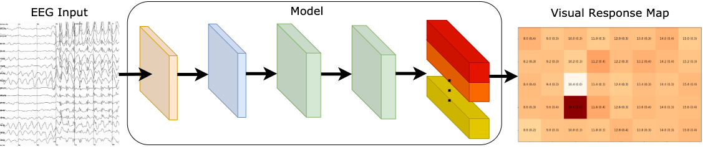
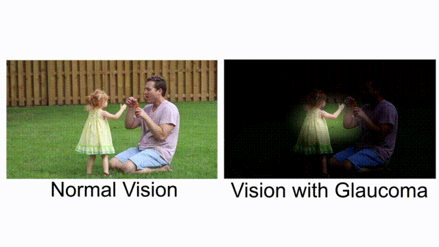
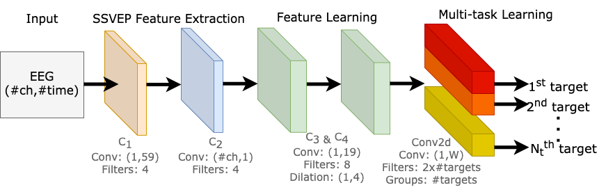
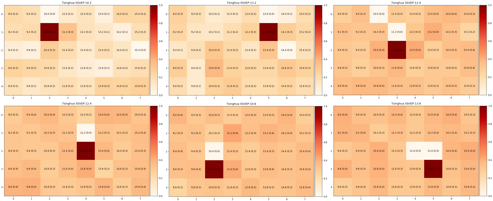
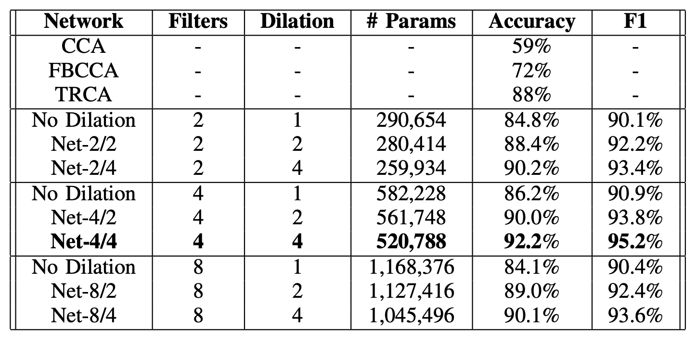

Using multi-task learning to efficiently captures signals simultaneously from the fovea and the neighboring targets in the peripheral vision, generating a visual response map. A calibration-free user-independent solution, desirable for clinical diagnostics. A stepping stone for an objective assessment of glaucoma patients' visual field. Watch our [video presentation on YouTube](https://www.youtube.com/watch?v=8isS5gR0wtM).



---

## Introduction

Humans are good at picking up sensory cues that cause a drastic change or pain. But what about gradual changes, like deteriorating eyesight, when the changes are so slight and so slow that people would not be able to notice it. The basis for healthcare in many countries is for patients to look for medical care when they are symptomatic. With this approach, individuals would need to know what their symptoms are. But what about asymptomatic diseases? That people would not be able to notice until a later stage, where their quality of life is significantly affected due to vision loss.

This is Glaucoma.



*Comparing normal vision and vision with glaucoma. [Combine by author, original clip’s [source](https://www.pexels.com/video/father-blowing-bubbles-for-her-daughter-3738655/)]*

With the increase in the aging population, we are challenged to find solutions to provide healthcare needs for the elderly. As you age, the chance of you becoming blind is higher, with more than 80% of the world’s blind people older than 50. Overall, 75% of blindness from all causes is preventable, treatable, or curable.

This research work tackles this issue by applying [brain-computer interface](https://jinglescode.github.io/2020/03/03/fascinating-relationship-between-ai-neuroscience/) methods in clinical screening and diagnostic procedures. This could potentially provide a more accurate diagnosis of visual function detection in asymptomatic cases.

## About glaucoma and its impact

[Glaucoma](https://en.wikipedia.org/wiki/Glaucoma) is known as a “silent thief of sight”. It is an eye condition that gradually develops over time, stealing away vision. Bit by bit, you are slowly becoming blind, and you don’t realize it until it’s too late. Vision loss from glaucoma once it has occurred, is permanent. It has no warning signs; as you can see from this example, when both eyes have different affected regions, the patients will not notice it until at an advanced stage.


*Asymmetrical visual field loss in glaucoma can lead to late presentation as with both eyes open the patient sees no defect. [[source](https://www.ncbi.nlm.nih.gov/pmc/articles/PMC3588129/)]*

A [report by the World Health Organization](https://www.who.int/docs/default-source/documents/publications/world-vision-report-accessible.pdf) states that the number of people with glaucoma has been projected to increase 1.3 times between 2020 (76 million) and 2030 (95.4 million). As the aging population grows, the number with this condition will also increase substantially.

There are no warning signs from the silent thief. With studies shows that 50% of undiagnosed glaucoma patients already had significant visual field defect during diagnosis. As patients usually do not notice any change in visual function, they do not seek medical care.

Glaucoma damage to the optic nerve is irreversible, and it progresses in the majority of cases without the appropriate treatment. Therefore, it is crucial to have preemptive screening to find patients in their initial stage. The only solution is early treatment.

## Limitations of the existing screening method

The diagnosis of glaucoma involves the patients to assess their visual functions via a visual field test with a physician. A [visual field test](https://www.glaucoma.org/treatment/what-is-a-visual-field-test.php) is a method of measuring an individual’s vision — central and peripheral vision. Visual field testing maps the visual fields of each eye individually and can detect blind spots ([scotomas](https://en.wikipedia.org/wiki/Scotoma)), as well as more subtle areas of dim vision. The test would examine any defects in the patient’s visual fields and function, such as losing peripheral vision. The purpose of glaucoma screening tests is to detect those with early-stage disease so that these patients can be treated to reduce the risk of vision loss. How can we measure visual fields?

[Standard automated perimetry](https://eyewiki.aao.org/Standard_Automated_Perimetry), in short, we call it SAP. This is the current method that physicians use to assess the blind areas in the visual field, to monitor visual function for glaucoma patients. The examiner would perform the test one eye at a time. It will present a series of stimuli (which are spots of blinking lights), one at a time, while the patient has to maintain fixation at a central target during the entire procedure. The patient presses a button if and when they see the light. These responses would then be recorded and form a map of the patient’s field of view.

This visual field test by SAP is a subjective examination. It requires the patient to understand the testing instructions, fully cooperate, and complete the entire visual test to provide useful test results. The test procedures take about 10 minutes per eye. 10 minutes of absolute focus and attention on a central point. 10 minutes of remembering to press a button when the stimulus is shown. Therefore, it is common to encounter false positives results as the patients press the button even though there is no stimulus present.

There is also a high false negatives rates when the patient does not respond to a light stimulus that should have been detected. This is especially so when the patient is not paying attention during the course of the test. The patient could lose fixation to the central target due to fatigue and distraction, affecting the test results’ reliability.

All these conflicting results hinder the physician’s decision to make a diagnosis. The reliability of a single measurement may be low; several consistent measurements are needed to establish the presence of defects. As such, more multiple tests are needed, which in turn can lead to a delay in diagnosis. These factors highlight a need for a technological solution that provides an objective assessment to improve visual field test.

How can we remove the subjectivity from the current visual field test procedure? What can we use to measure visual fields more precisely instead of relying on the patient’s pressing on a button? Can we shorten the time for visual field assessment?

## Combining brain-computer interface and machine learning

The main idea of our study is illustrated in this figure.


*The patient will focus on a central point for a few seconds, and we will capture signals from the fovea and the neighboring targets in the peripheral. Our model predicts the presence of all the SSVEP frequencies in the entire vision field. That is, if a patient has a blind area in a region, the signals extracted from these stimuli are weak, and it is reflected on the visual response map. [[Image by Author](https://jinglescode.github.io/ssvep-multi-task-learning/)]*

Our aim is to implement a system that produces visual field tests results that are more reliable as we eliminate the cognitive aspect in existing visual field assessment. By doing so, patients do not have to learn to use the system, and test results are not affected by patients being distracted or feeling uncomfortable.

[Steady-state visual evoked potential](https://en.wikipedia.org/wiki/Steady_state_visually_evoked_potential) (SSVEP) can generate brain signals when we look at something flickering, typically at frequencies between 1 and 100 Hz. In this experiment, these flickering lights are blinking on the screen. These flickering lights are called stimuli.

The patients will focus on a central point for a few seconds, and we will capture their brain signals via [Electroencephalography](https://jinglescode.github.io/2020/02/24/control-exoskeleton-with-your-brain/) (EEG). EEG is an electrophysiological monitoring method to record the electrical activity of the brain.

Our focus is to detect multiple signals from the entire visual field to diagnose glaucoma patients. In our work, we extracted features from the EEG signals. With our approach, we were able to generate a visual response map that displays the seeing parts of the patient’s field of view.

Our model predicts the presence of all the SSVEP frequencies in the entire visual field. That is, if a patient has a blind area in a region, the signals extracted from these stimuli are weak, and it is reflected in the visual response map.

Since our model can detect the presence of multiple stimuli, we can reduce visual field assessment time and produce reliable test results. This could be potentially suitable for providing a rapid point-of-care diagnostics for glaucoma patients.

## Model Architecture

Our model is made up of 3 parts, 1) SSVEP feature extraction, 2) feature learning, and 3) multi-task learning block. An illustration of the proposed network is shown below.



*Our neural network is composed of four convolution blocks, responsible for learning EEG representations across all target frequencies. The fifth convolution layer is a multi-task learning block, where it learns to differentiate multiple SSVEP target frequencies. [[Image by Author](https://jinglescode.github.io/ssvep-multi-task-learning/)]*

### SSVEP feature extraction

The purpose of this component is to decode raw EEG signals into input features for our model. There are two convolution blocks (C1 and C2); each convolution block consists of a convolution layer, a batch normalization, and an exponential linear unit.

C1 block was designed to extract the spectral representation of the EEG input, as it performs convolution across the time dimension, capturing features from each EEG channel independently from the others.

C2 block was designed for conducting spatial filtering, as it performs convolutions across the channel dimension. The objective of this layer is to learn the weights of all channels at each time sample.

### Feature learning

Here, there are two convolution blocks (C3 and C4), the purpose of these blocks are capturing the temporal patterns in each extracted feature maps.

We also explored different dilation configurations on C3 and C4 blocks. As the kernel size needed for signals is much larger than for images, dilation convolutions allow us to expand the receptive field, perform feature learning with a smaller kernel size, produce a smaller model, and potentially increase performance.

### Multi-task learning block

The fifth and final convolution block learns to differentiate multiple SSVEP target frequencies. We made use of methods from multi-task learning and designed this block to produce multiple outputs.

In classic [multi-task learning](https://en.wikipedia.org/wiki/Multi-task_learning) architectures, each task is separated into task-specific layers, where each layer is responsible for learning to identify each task. But instead of duplicating a convolution layer for each output, we perform convolutions by groups. We are essentially performing separate convolutions within a single convolution layer. This allowed us to train multiple tasks in parallel efficiently on a single GPU, and we can dynamically tweak our model scale to any number of tasks effectively, which is potentially suitable for other multi-task learning applications.

## Results (multi-label) — Visual Response map

Our model is a unified system that generates a visual response map by learning to distinguish 40 frequencies. We predict the presence of all target frequencies simultaneously. As such, this enables us to visualize what the user has seen with a visual response map.



*Some examples of visual maps, where darker shade symbolize stronger signals from that SSVEP stimuli. [[Image by Author](https://jinglescode.github.io/ssvep-multi-task-learning/)]*

Here are some examples of visual maps, where darker shade symbolize stronger signal from that SSVEP stimuli. We selected 6-targets that are located around the center of the screen, as this is the region of interest for visual field assessment in our future work. We have evaluated our models with the leave-one-subject-out method to exhibit the generality of our approach, and our approach requires little or no calibration for new users.

## Results (multi-class) — Classification

We can also use our network as a classifier. As such, we can compare our model against the existing state of the art methods for SSVEP classification accuracy.



*Compare our model against other CCA-based methods, and various model configurations. [[Image by Author](https://jinglescode.github.io/ssvep-multi-task-learning/)]*

With a 1-second signal per trial, [Canonical Correlation Analysis](https://en.wikipedia.org/wiki/Canonical_correlation) (CCA), [Filter Bank Canonical Correlation Analysis](https://pubmed.ncbi.nlm.nih.gov/26035476/) (FBCCA), and [Task-Related Component Analysis](https://www.jaist.ac.jp/~hirokazu/Site/Publicatons_files/TanakaKaturaSatoNeuroImage2013.pdf) (TRCA) yielded approximately 59%, 72%, and 88% accuracy, respectively. Using our proposed method, we can effectively identify the foveal’s target frequency, achieving 92% accuracy in a leave-one-subject-out scenario.

Evidently, this result shows that our approach can be an alternative to identifying a single flickering target where the focus is on delivering reliable SSVEP responses detected on fovea vision.

## Conclusion

This study presented a deep learning method that potentially enables us to detect multiple SSVEP stimuli simultaneously, thus mapping a visual map of glaucoma patients, reducing visual field assessment time, and produce reliable test results.

In view of recent events during disease outbreak and pandemics where non-essential hospital appointments are recommended to be kept to a minimum, this assessment method can reduce the number of tests needed, thus minimizing any unnecessary or additional tests. In essence, this study enables our future work to potentially assess glaucoma patients’ visual field to detect peripheral vision loss. To improve the reliability of the assessment results, utilizing SSVEP could eliminate a patient’s ability to carry out the procedure and variability of the patient’s mental state. Assessment time could be cut down by detecting multiple SSVEP targets at once and generating a visual response map. Our approach could be potentially suitable for providing a rapid point-of-care diagnostics for glaucoma patients.

## Citation

If you use the model in your research or found it helpful, please cite the following paper:

```
@inproceedings{khok2020deep,
  title={Deep Multi-Task Learning for SSVEP Detection and Visual Response Mapping},
  author={Khok, Hong Jing and Koh, Victor Teck Chang and Guan, Cuntai},
  booktitle={2020 IEEE International Conference on Systems, Man, and Cybernetics (SMC)},
  pages={1280--1285},
  year={2020},
  organization={IEEE}
}
```

## Code

Our model was developed with PyTorch, our codes are on [GitHub](https://github.com/jinglescode/ssvep-multi-task-learning).

<script src="https://gist.github.com/jinglescode/b99c0c3c31af5c217c6305cacb7e16b0.js"></script>
